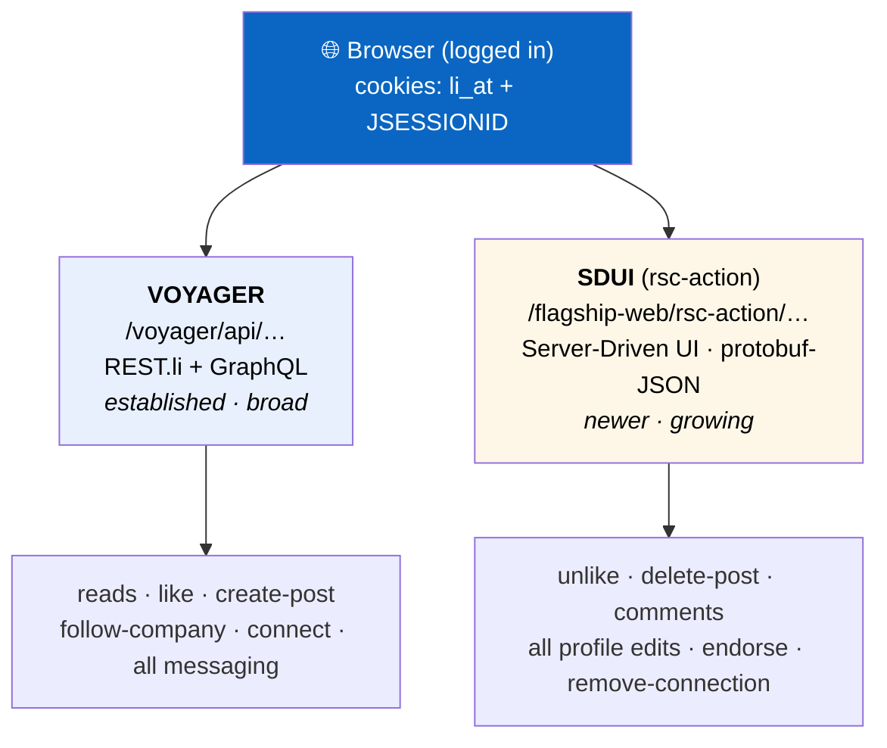
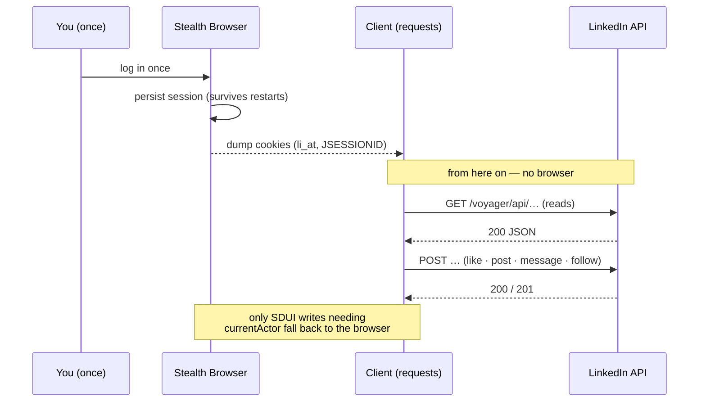
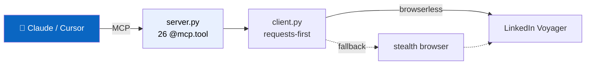
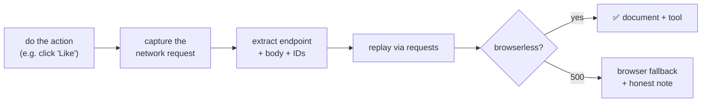

<div align="center">

# 🔗 LinkedIn Internal API — Reference & MCP Server

**A reverse-engineered, honestly-documented client for LinkedIn's private web API — plus a ready-to-use MCP server that lets an AI assistant read and write LinkedIn for you.**

`Voyager + SDUI` · `130 endpoints (141 raw captures)` · `26 MCP tools` · `browserless-first` · `every ✅ captured from real traffic`

</div>

---

> ⚠️ **Disclaimer — read before use.** This is an independent **research / personal-automation**
> project. It is **not affiliated with, endorsed by, or connected to LinkedIn.** It automates
> LinkedIn's *private* web API, which is a grey area under LinkedIn's Terms of Service. Use it
> **only on an account you own**, at your own risk — automated activity can get an account
> restricted or banned. No warranty (see [`LICENSE`](LICENSE)). LinkedIn rotates its GraphQL
> query-id hashes on deploys, so endpoints may break without notice.

---

## 🎯 What is this?

LinkedIn's *official* API can't edit your profile, send messages, manage your network, or read
your own posts in full. But the **LinkedIn website** does all of that — by talking to two private
backend APIs. This project **reverse-engineers those APIs** from real logged-in traffic, documents
every endpoint honestly (verified ✅ vs. discovered 🔍 vs. inferred 🔩), and ships a **Model Context
Protocol (MCP) server** so a tool like Claude can drive a LinkedIn account programmatically.

> **Every endpoint marked ✅ was captured from live traffic and executed against the real client —
> never guessed.** Test data created during capture was deleted and verified clean afterwards.

**Scope:** control of the account **owner's own** profile — editing, posts, messaging, comments,
network. **Identity is never stored in the repo** — you supply it via environment variables.

---

## 🗺️ Two API worlds

LinkedIn's frontend talks to **two parallel backends**. Many features live in only one — you have
to know both.



**Rule of thumb:** if it works over Voyager, use it (stable, no browser). Fall back to SDUI only
when Voyager fails. Note the mixed patterns — *create post = Voyager, delete post = SDUI; like =
Voyager, unlike = SDUI.*

---

## 🔌 Browserless-first

The key finding: **most operations need no browser.** With fresh session cookies, plain Python
`requests` hits Voyager directly. A stealth browser is only the **session source** and the fallback
for the few SDUI writes that need page-bound context.



**Why stealth?** A normal automated Chrome gets logged out fast. A persistent patchright context
(`navigator.webdriver = false`) stays logged in across crashes — you log in **once**.

---

## 🧩 The `states[]` breakthrough

SDUI profile forms looked un-replayable — their field values are opaque `MemoryNamespace`
state-refs. But they send every value **twice**: also as real literals in a top-level `states[]`
array. That makes them replayable from pure `requests`. A `saveProfileLanguageForm` create was
replayed with a self-generated uuid + `states[]` value → **HTTP 200, live change on the profile.**
→ `docs/BROWSERLESS-REPLAY.md`.

---

## 🤖 The MCP server (26 tools)

`mcp/` is a [FastMCP](https://github.com/jlowin/fastmcp) server exposing the API as tools any MCP
client (Claude Desktop, Cursor, …) can call.



| Domain | Tools |
|---|---|
| **Reads** (browserless) | `get_me` · `get_my_posts` · `get_profile` · `get_notifications` · `get_conversations` · `get_connections_summary` · `get_post_comments` · `get_link_preview` |
| **Posts** | `create_post` (+poll) · `edit_post` · `delete_post` · `create_poll` · `save_post` · `repost` · `delete_repost` |
| **Engagement** | `like` (browserless) · `unlike` (browser) |
| **Messaging** | `send_dm` · `recall_message` · `react_to_message` |
| **Network** | `follow_company` · `connect` · `endorse_skill` · `remove_connection` |
| **Session** | `session_status` · `refresh_session` |

🔒 **Guardrails:** people-facing / destructive tools (`create_post`, `edit_post`, `delete_post`,
`send_dm`, `recall_message`, `repost`, `delete_repost`, `connect`, `remove_connection`) require
`confirm=True`.

### Run it

```bash
cd mcp
uv venv .venv --python 3.11
uv pip install --python .venv/bin/python fastmcp patchright requests
.venv/bin/patchright install chromium

# your identity comes from the environment — nothing is hard-coded in the repo:
export LI_OWNER_URN="urn:li:fsd_profile:<your-id>"
export LI_OWNER_VANITY="<your-vanity-name>"

.venv/bin/python tests/test_server.py     # offline → 4/4
.venv/bin/python tests/test_client.py     # offline → 19/19
.venv/bin/python bootstrap_login.py        # first run: log in once in the stealth window
.venv/bin/python server.py                 # stdio (Claude Desktop / Cursor / Hermes)
```

---

## 🔬 The method: click-and-record

You can't guess write endpoints — the request bodies are deeply nested and deployment-specific.
The only reliable way: **perform the real action, record the exact request it fires.**



Reads were found by a self-discovering crawler; writes by click-and-record. → `docs/05-VERIFICATION.md`,
reusable procedure in `CAPTURE-PLAYBOOK.md`.

---

## ✅ Coverage

- **Profile editing** — 16 sections **documented** (reverse-engineered `saveProfile<X>Form`
  pattern). Persisted capture artifacts back a subset: full add/edit/delete for 5, add-only for 3,
  delete-only for 1 — each per-section doc (`docs/09`–`21`) states its exact status. *(Reference
  docs — profile editing is not exposed as an MCP tool; the 26 tools are reads/posts/messaging/network.)*
- **Posts** — create, edit, delete, poll, media, @mention, save/unsave, repost, link-preview
- **Messaging** — send, recall, react, list conversations (all browserless)
- **Engagement** — like (browserless), unlike (browser)
- **Network** — connect (+note), endorse skill, remove connection, follow company
- **Reads** — profile, own posts *in full text* (the gap Composio can't fill), notifications, inbox
- **Contact-info** — save endpoint captured

**Open (documented honestly as such):** hashtag-follow, profile language, photo/cover upload, jobs,
settings, recommendations, quote-repost.

---

## 📚 Documentation map

| Start here | What |
|---|---|
| **[`docs/00-OVERVIEW.md`](docs/00-OVERVIEW.md)** | The two API worlds, decision rules |
| **[`docs/COVERAGE-MAP.md`](docs/COVERAGE-MAP.md)** | Every function → endpoint → status (live checklist) |
| **[`docs/ENDPOINTS.md`](docs/ENDPOINTS.md)** | Flat list of all endpoints (130 distinct / 141 raw) + verified-write table |
| `docs/01` · `02` · `03` | Auth/cookies · Voyager deep-dive · SDUI deep-dive |
| `docs/04-WRITE-OPERATIONS.md` · `docs/05` | Every verified write, with request bodies · Feed/read discovery |
| `docs/06` · `07` · `08` | Messaging · Comments · Network |
| `docs/09`–`22` | Profile editing (16 sections + contact-info + about + open-to-work) |
| `docs/10` · `23` | Post interactions (like/save/repost) · Read & discovery endpoints |
| `docs/24` · `25` | Advanced posts (edit/poll/media/mention) · Network & contact actions |
| `docs/BROWSERLESS-REPLAY.md` | The `states[]` finding in depth |
| `docs/MCP-DESIGN.md` | Why the server is built the way it is |

---

## ⚠️ Notes

- **No personal identity in the repo.** Owner URN / vanity come from `LI_OWNER_URN` /
  `LI_OWNER_VANITY`; personal identifiers in the docs are placeholders (`OWNER_PROFILE_ID`,
  `alex-rivera`, `SECTION_ITEM_ID`, `COMPANY_ID`, …). A few structural constants remain as real
  values where they are public and non-personal (e.g. Microsoft's company id `1035` in a test,
  GraphQL `queryId` hashes, LinkedIn URN type names).
- **Terms of Service.** Automating LinkedIn is a grey area under its ToS. This is a research /
  personal-automation project for one's **own** account. Use responsibly, at your own risk.
- **No warranty.** LinkedIn rotates GraphQL query-id hashes on deploys; when a call starts
  returning 404, re-capture the current hash (the docs say where).
